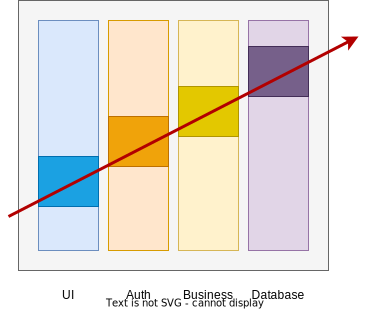

# Short and sweet

## Tracer Bullet Approach

From "The Pragmatic Programmer" by David Thomas and Andrew Hunt

---

# Intro

Ever implemented something almost till the end, only to then to notice that the last piece isn't working as expected?

The "Tracer Bullet Approach" may help with this!

---

# Tracer Bullet

* used by soldiers to track their shots in the dark
* soldiers can align their aim based on the trace

---

# In Software Development

We have
* difficult integrations
* uncertain client requiments
* implementations with lots of unknowns

Software "Tracer Bullets" to the rescue!

---

# "Code that glows in the dark"

* implement areas with risks/doubts first and minimal
* start with simple "Hello World" project
* implement a new feature first through all layers

---

# Tracer Bullet for integrations

---

# Advantages

* quick feedback on risky areas
* first draft can be presented fast
* early integration verification
* early (code) structure devs can work with

---

# References

[The Pragmatic Programmer book by David Thomas and Andrew Hunt](https://pragprog.com/titles/tpp20/the-pragmatic-programmer-20th-anniversary-edition/)

---

# AKA (also know as)

This approach is also known as / similar too
* technical spike
* test balloon
* (technischer) Durchstich (German)
* Dünne Mann (German)

Though it is not a prototype as prototypes are thrown away. Implementations with Tracer Bullets are not.

---

# Q&A
